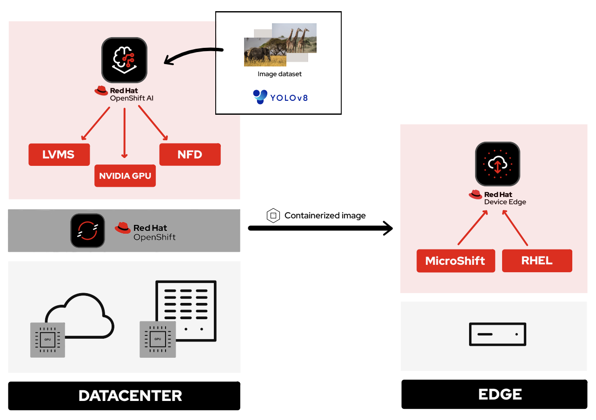

# SAFARI demo | Computer Vision at the Edge
The goal of this series is to make use of the power and versatility of [Red Hat® OpenShift](https://www.redhat.com/en/technologies/cloud-computing/openshift) for the preparation and deployment of computer vision applications at the edge. In environments where resources are limited, [Single Node OpenShift®](https://www.redhat.com/en/blog/meet-single-node-openshift-our-smallest-openshift-footprint-edge-architectures) (SNO) can be used as a data center for model processing and training. It can run on both cloud and bare metal nodes. On such nodes we will deploy [Red Hat® OpenShift® AI](https://www.redhat.com/en/technologies/cloud-computing/openshift/openshift-ai) and the necessary components to enable GPU hardware and accelerate our model training. OpenShift AI gives us the possibility to use Notebooks where we will import our YOLO algorithm and the necessary dataset for training. Finally, with OpenShift Virtualization, we will simulate a device at the edge. There, we are going to install MicroShift and deploy our Safari application on top of it. This app will be able to detect animals in real time and give us information about them.

Below, you'll find a list of the different chapters in the collection:
* [How to install single node OpenShift on AWS](https://developers.redhat.com/articles/2024/04/29/how-install-single-node-openshift-aws)
* [How to install single node OpenShift on bare metal](https://developers.redhat.com/articles/2024/04/29/how-install-single-node-openshift-bare-metal)
* [Red Hat OpenShift AI installation and set up](https://developers.redhat.com/articles/2024/05/01/red-hat-openshift-ai-installation-and-setup)
* [Model training in Red Hat OpenShift AI](https://developers.redhat.com/articles/2024/05/02/model-training-red-hat-openshift-ai)
* [Prepare and label custom datasets with Label Studio](https://developers.redhat.com/articles/2024/05/02/prepare-and-label-custom-datasets-label-studio)
* [Deploy computer vision applications at the edge with MicroShift](https://developers.redhat.com/articles/2024/05/03/deploy-computer-vision-applications-edge-microshift)

